# READ ME!

### 💡 서비스 소개 : 냠냠프렌즈

:crown: SSAFY 9기 공통 프로젝트 '최우수' 프로젝트 선정

---

:iphone: 서비스 한 줄 소개

**WebRTC & AI 기반 유아 식사 독려 서비스 '냠냠프렌즈'**

:baby: 아이 밥을 먹이려고 전쟁을 치루던 시간은 이제 그만!

냠냠프렌즈를 통해 영양 섭취가 필수인 아이들에게 '식사를 재밌고 즐거운 시간으로!' 만들어보세요!

</aside>

### 💡 기획 의도

---

밥을 먹기 싫어하는 아이들에게 밥을 먹이는 시간은 전쟁과도 같습니다.

아이들이 밥을 먹게 하기 위해서 Youtube를 틀어주고 TV를 틀어주는 노력을 다들 해보셨을 것이라 생각합니다.

하지만,  Youtube나 TV에 집중하다보면 식사에 집중하는 시간은 현저하게 떨어집니다.

또한 일찍이 미디어 영상에 노출되는 것도 아이에게 좋지 않기 때문에 많은 걱정을 하는 부모님들이 계십니다.

 

그래서 만들었습니다!

냠냠프렌즈는 AI 얼굴인식을 통해 귀여운 캐릭터 모자를 씌워주고

또, 아이가 밥을 먹는 것을 AI로 인식하여 무시무시한 '세균이와 병균이'를 무찌르는 모습을 보여줍니다.

이를 통해 식사를 마치고 게임을 클리어한다면 '새로운 캐릭터'를 얻게 될 수 있습니다!

 

냠냠프렌즈를 통해 식사를 즐겁고 행복한 시간으로 인식할 수 있게 아이들을 독려해주세요!

### 💡 팀 소개

---

:crown: 팀장: 권인식

:smile: 팀원: 김동현 김은비 라동엽 성제현 이종윤

 

PM : 권인식

Frontend : 권인식, 김동현, 김은비, 성제현

Backend : 이종윤, 권인식, 라동엽

Server: 권인식, 이종윤

CI/CD: 권인식

Mobile & Design: 성제현, 김은비, 김동현

Unity: 이종윤

AI: 라동엽

### 🗓️ 프로젝트 진행 기간

---

***2023.07.04~ 2023.08.18 (총 7주)***

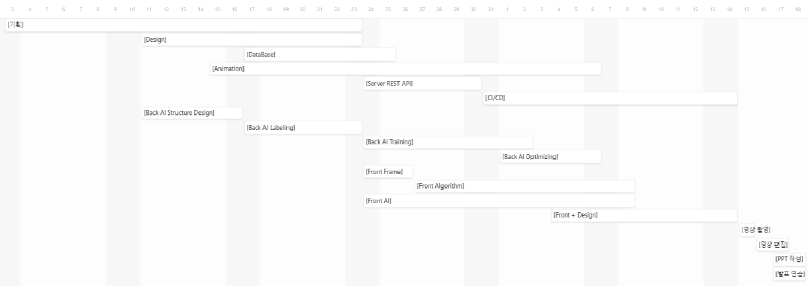

### 💻 냠냠프렌즈 메인 서비스

---

- Singleplay 모드
  
  
  
  
  
  OpenVidu 사용해 관전 observation page 제공 webRTC 통신
  
  - tenserflow 라이브러리를 사용하여 얼굴 detection을 좌우 눈 좌표 획득 해 얼굴 폭을 계산후 모자 이미지를 머리 위에 부착
  
  - 실시간으로 flask 서버에 이미지 전송
  
  - flask 서버에서 식사 startpoint 받아오기
    
    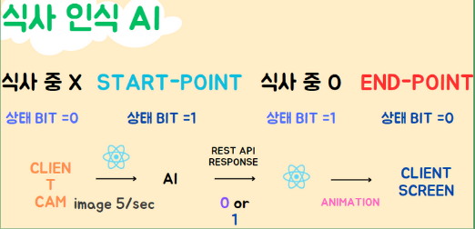  

- Multiplay 모드
  
  
  
  - WebSocket을 통해 같은 OpenVidu Session 내에 있는 사용자의 음식 섭취 Start Point 데이터를 주고받고 이를 각자의 캐릭터에 적용하여 실제 Real Time Multi Play 모드를 지원합니다.
  
  - 내가 밥을 먹을 때는 내 캐릭터가 빨리 달리고!
    
    친구가 밥을 먹을 때는 친구 캐릭터가 빨리 달립니다!
    
    함께 식사 횟수를 모두 충족하여 병균이와 세균이를 무찔러 보세요!ㄴ
    
    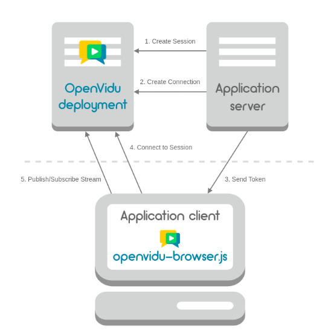

### 📱 냠냠 프렌즈 구성 화면

---

- 로그인 페이지
  
  

- 메인 페이지
  
  

- 대표 캐릭터 설정 페이지
  
  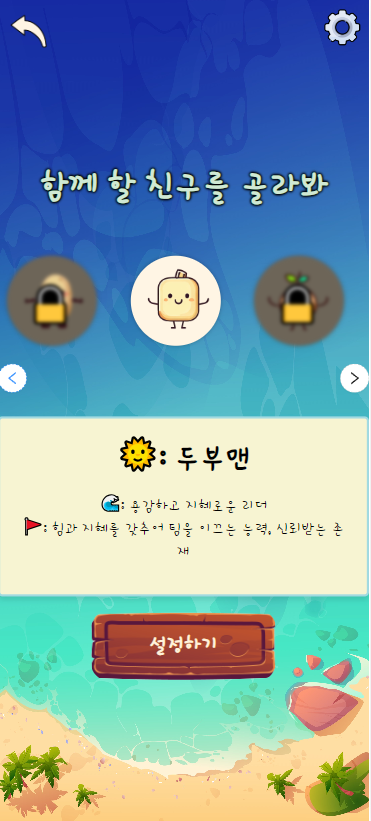

- 캐릭터 획득 페이지
  
  

- 설정 페이지

### 🏗️ 아키텍쳐

---

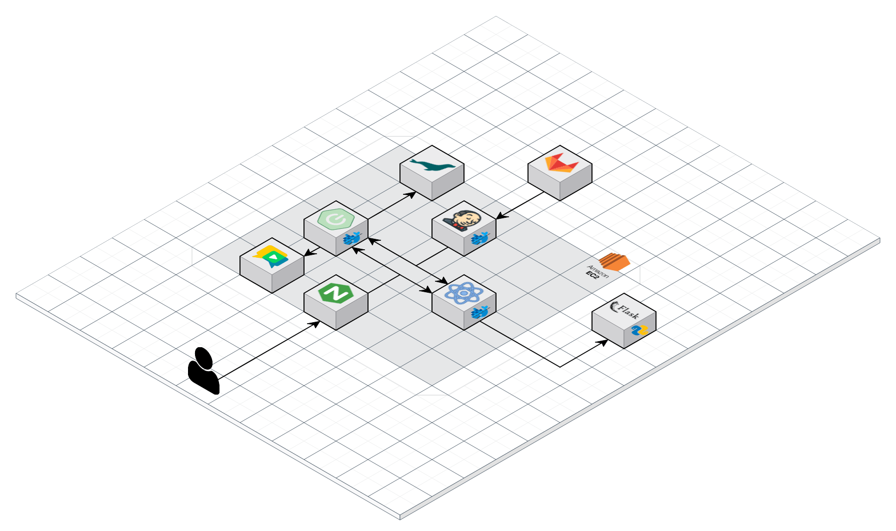

### 📊 ERD

---

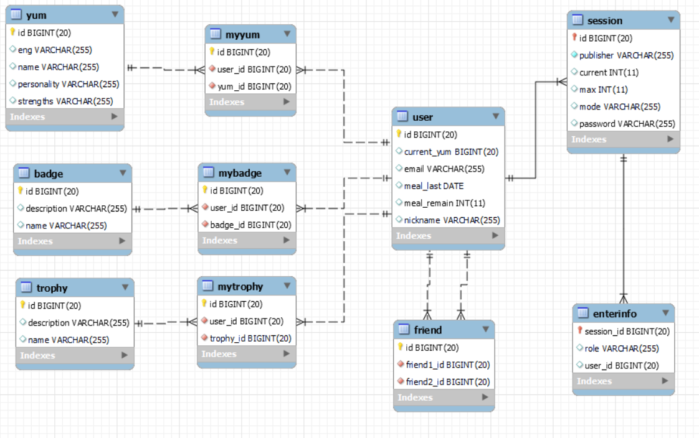

### 🛠️ 기술 스택

---

- **Front-End**
  
  - JavaScript
  
  - TypeScript
  
  - React
  
  - Redux
  
  - TensorFlow
  
  - OpenVidu

- **Back-End**
  
  - Java 17
  
  - Spring boot 4.19.0
  
  - Spring Web
  
  - Spring Data JPA
  
  - Lombok
  
  - Swagger 2
  
  - Openvidu 2.28.0
  
  - Mariadb
  
  - Tomcat

- **AI**
  
  - Python 3.10.9
  
  - Pycharm
  
  - Pytorch 1.13.1+cu116
  
  - Flask 2.3.2
  
  - Numpy 1.24.3
  
  - Opencv-Python 4.8.0
  
  - Matplotlib 3.7.2

- **Server**
  
  - AWS
  
  - EC2
  
  - Ubuntu
  
  - Linux
  
  - Nginx
  
  - Docker
  
  - Docker Hub
  
  - Jenkins
  
  - Putty
  
  - Certbot
  
  - Letsencrypt
  
  - FileZilla

### 😁 ai 실행방법

---

1. requirements 다운로드
   pip install -r requirements.txt

2. cuda 11.6 다운로드

3. torch 다운로드
   pip3 install torch torchvision torchaudio --index-url https://download.pytorch.org/whl/cu116

4. 플라스크 path 수정
   ./uitils/flask_rest_api/restapi_test.py의 58번 라인 본인 path로 수정
   models[m] = torch.hub.load('your project path', 'custom', path = 'your weights path', source='local')

5. ./uitils/flask_rest_api/restapi_test.py 실행 (gtx 1060 6gb 이상의 사양 권장)
   
   ##### 실험환경
   
   CPU : 11th Gen Intel(R) Core(TM) i7-11600H @ 2.90GHz 
   RAM : 32GB
   GPU : NVIDIA GeForce RTX 3050 Ti Laptop GPU
   
   ##### 데이터 구축

6. 유투브 프레임 추출
   
   - 유투브 먹방 영상에서 캡처를 통해 500여장의 이미지 수집

7. data annotation
   
   - label-studio를 사용하여 데이터 라벨링 진행

8. background image 
- recall을 높이기 위해 데이터 셋에 background image 추가
  
  ##### AI 학습
1. yoloV5
   - yoloV5를 사용해 학습하였다. yoloV8이 sota 모델이지만, 실시간 구현을 위해 더 가벼운 v5모델을 사용하였다.
2. hyperparameter turning
   - loss함수의 hyperparameter를 구축한 데이터에 맞춰 수정하였다.
3. PAN 확장
   - 음식을 먹는 입모양을 탐지해서 식사인식을 진행 했기 때문에 탐지하는 객체가 작았다. 따라서 작은 객체의 인식률을 높히기 위해서 PAN 을 확장 하였다.

### 👩‍👩‍👦‍👦 협업 툴

---

     

  

---

### Jira

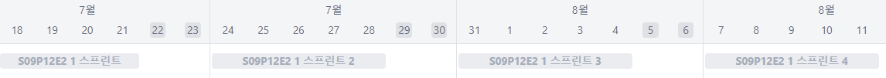

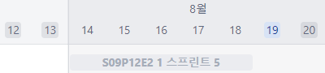

sprint 1

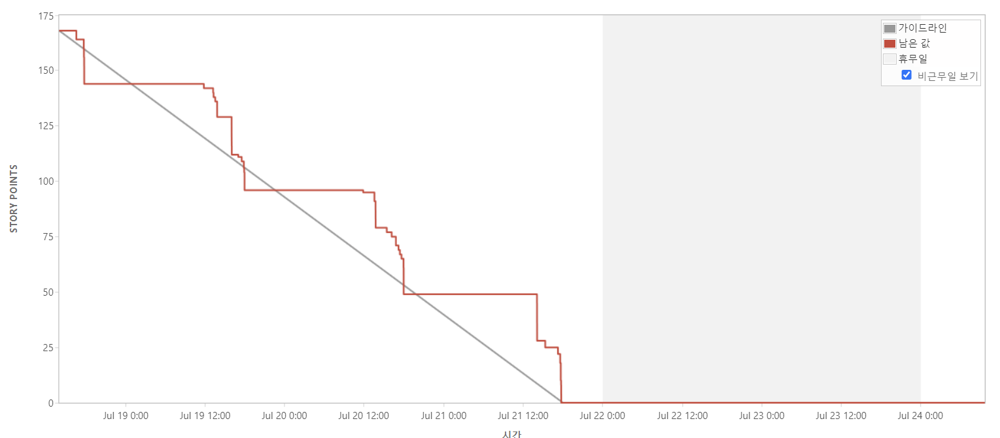

sprint 2

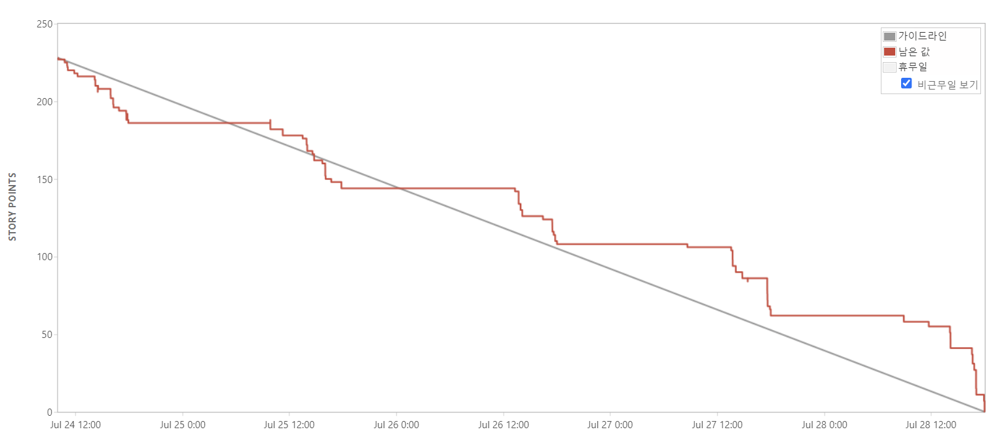

sprint 3

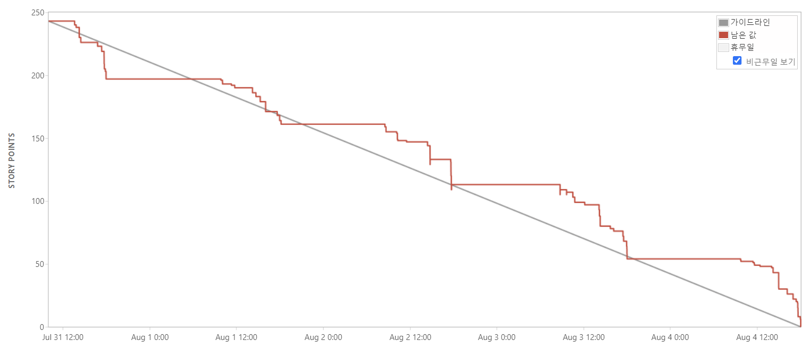

sprint 4

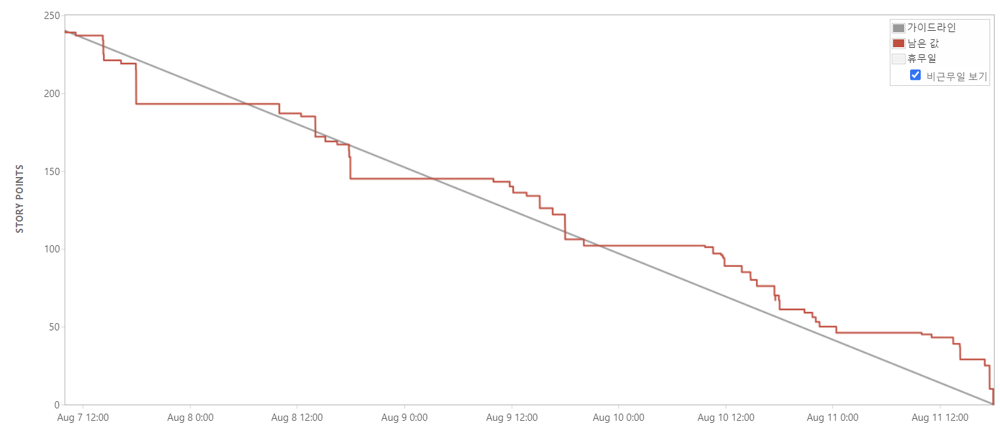

sprint 5

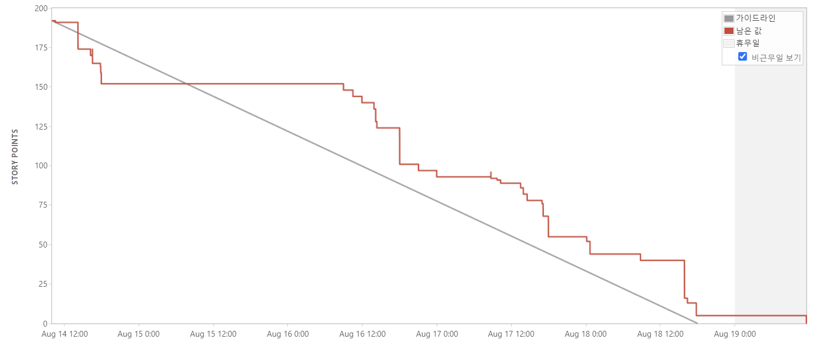

Epic

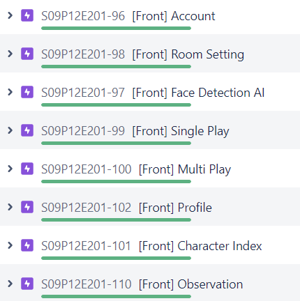

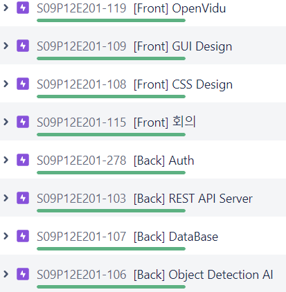

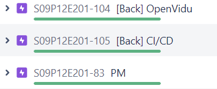

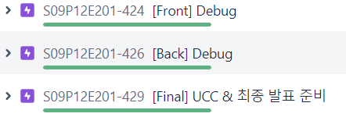

---

### 👩‍👩‍👦‍👦 Git Convention

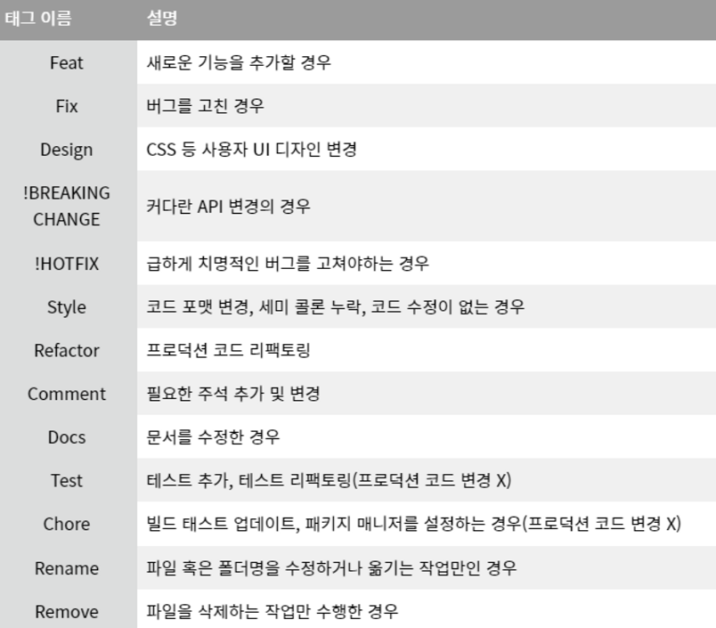
