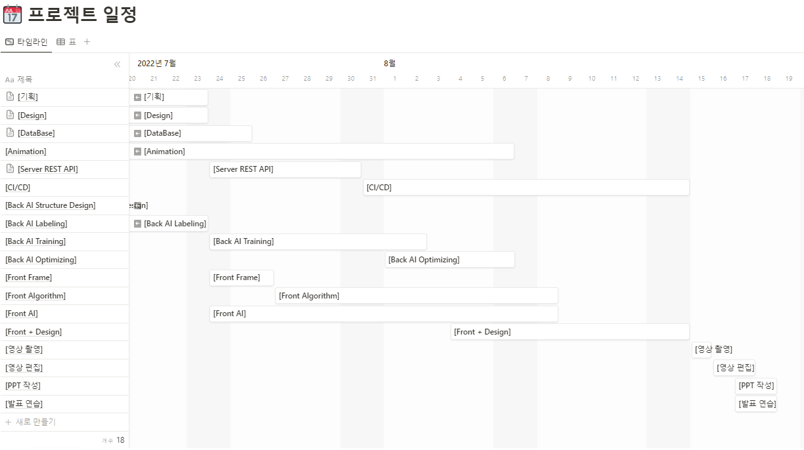
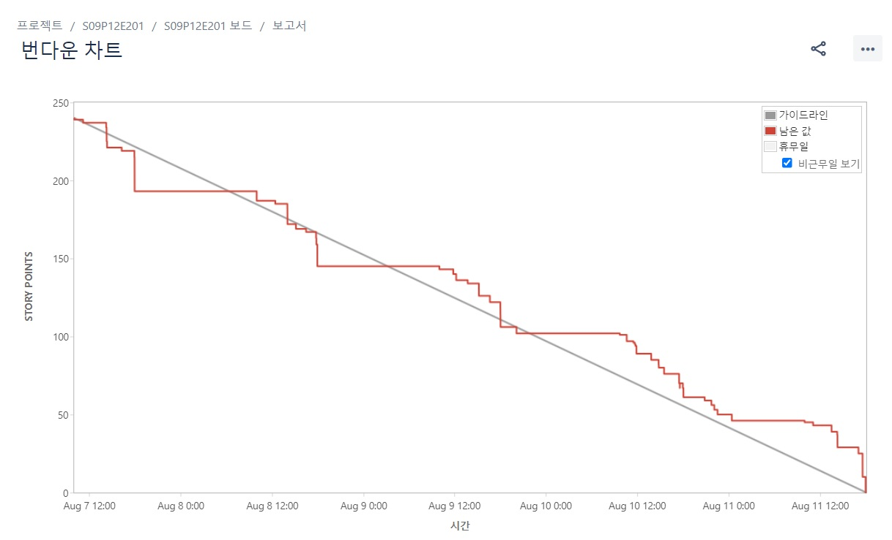
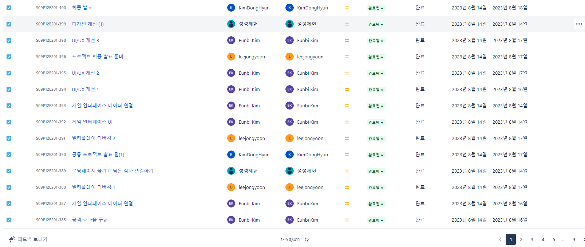
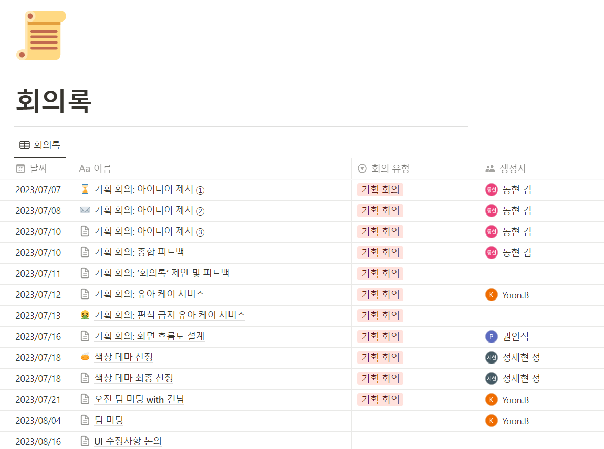

# Read me!

### 💡 서비스 소개 : 냠냠프렌즈

---

<aside>
🗨️ AI를 사용한 식사 유도 유아용 게임

유아가 식사를 스스로 할 수 있도록 독려해주는 게임 입니다.
귀여운 캐릭터 및 서비스가 제공됩니다.
부모님 또한 참관기능을 통해 아이가 식사하는 모습을 볼 수 있습니다.
멀티 플레이를 이용한 2인용 게임을 지원합니다.

PWA를 사용해서 모바일로 웹 앱으로 게임을 진행 할 수 있습니다.
다양한 서비스를 통해 아이 스스로 끼니를 거르지 않고 건강한 식생활을 할 수 있도록 도와줍니다. 

</aside>

### 💡 기획 의도

---

밥을 잘 먹지 않는 아이 때문에 걱정하는 부모를 생각하며 만들었습니다. 성장기에 끼니를 거르면 아이에게 많은 영향이 갈 수 있습니다. 이와 같은 이유로 아이 스스로 식사를 찾고 식사에 흥미를 유발할 수 있는 프로젝트를 생각하고 기획했습니다.
 해당 서비스를 통해서 아이의 건강을 챙기고 부모님의 수고를 덜 수 있습니다.

### 💡 팀 소개

---

팀장: 권인식

팀원: 김동현 김은비 라동엽 성제현 이종윤

Frontend : 권인식, 김동현, 김은비, 성제현
Backend : 라동엽, 이종윤, 권인식

AI: 라동엽
Server: 권인식, 이종윤
CI/CD: 권인식
Design: 성제현, 김은비, 김동현
Unity: 이종윤

### 🗓️ 프로젝트 진행 기간

---

***2023.07.04~ 2023.08.18 (총 7주)***

### 💻 냠냠프렌즈 메인 서비스

---

- Singleplay 모드 + 관전
  
  
  
  
  
  OpenVidu 사용해 관전 observation page 제공 webRTC 통신
  
  - tenserflow 라이브러리를 사용하여 얼굴 detection을 좌우 눈 좌표 획득 해 얼굴 폭을 계산후 모자 이미지를 머리 위에 부착
  
  - 실시간으로 flask 서버에 이미지 전송
  
  - flask 서버에서 식사 startpoint 받아오기
    
      

- Multiplay 모드
  
  
  
  - webSocket을 활용해 멀티 모드 참여자의 식사 여부를 실시간으로 전송하여 게임 화면에 반영
    
    

### 📱 냠냠 프렌즈 구성 화면

---

- 로그인 페이지
  
  

- 메인 페이지
  
  

- 대표 캐릭터 설정 페이지
  
  

- 캐릭터 획득 페이지
  
  

### 🏗️ 아키텍쳐

---

### 📊 ERD

---

### 🛠️ 기술 스택

---

- **Front-End**

- JavaScript

- TypeScript

- ReactJs

- Redux

- TensorFlow

- openVidu

- **Back-End**

- Java 17

- Spring boot 4.19.0

- Spring Web

- Spring Data JPA

- Lombok

- Swagger 2

- Openvidu 2.28.0

- Mariadb

- tomcat

- **AI**

- Python 3.10.9

- Pycharm

- Pytorch 1.13.1+cu116

- Flask 2.3.2

- numpy 1.24.3

- opencv-python 4.8.0

- matplotlib 3.7.2

- **Server**

- nginx

- docker

- docker hub

- Jenkins

- putty

- Certbot

- Letsencrypt

- filezilla

- EC2

- Ubuntu

- AWS

### 😁 ai 실행방법

---

1. requirements 다운로드
   pip install -r requirements.txt

2. cuda 11.6 다운로드

3. torch 다운로드
   pip3 install torch torchvision torchaudio --index-url https://download.pytorch.org/whl/cu116

4. 플라스크 path 수정
   ./uitils/flask_rest_api/restapi_test.py의 58번 라인 본인 path로 수정
   models[m] = torch.hub.load('your project path', 'custom', path = 'your weights path', source='local')

5. ./uitils/flask_rest_api/restapi_test.py 실행 (gtx 1060 6gb 이상의 사양 권장)
   
   ##### 실험환경
   
   CPU : 11th Gen Intel(R) Core(TM) i7-11600H @ 2.90GHz 
   RAM : 32GB
   GPU : NVIDIA GeForce RTX 3050 Ti Laptop GPU
   
   ##### 데이터 구축

6. 유투브 프레임 추출
   
   - 유투브 먹방 영상에서 캡처를 통해 500여장의 이미지 수집

7. data annotation
   
   - label-studio를 사용하여 데이터 라벨링 진행

8. background image 
- recall을 높이기 위해 데이터 셋에 background image 추가
  
  ##### AI 학습
1. yoloV5
   - yoloV5를 사용해 학습하였다. yoloV8이 sota 모델이지만, 실시간 구현을 위해 더 가벼운 v5모델을 사용하였다.
2. hyperparameter turning
   - loss함수의 hyperparameter를 구축한 데이터에 맞춰 수정하였다.
3. PAN 확장
   - 음식을 먹는 입모양을 탐지해서 식사인식을 진행 했기 때문에 탐지하는 객체가 작았다. 따라서 작은 객체의 인식률을 높히기 위해서 PAN 을 확장 하였다.

### 👩‍👩‍👦‍👦 협업 툴

---

- JIRA
  
  
  
  

- 노션
  
  

- gitlab

- mattermost
